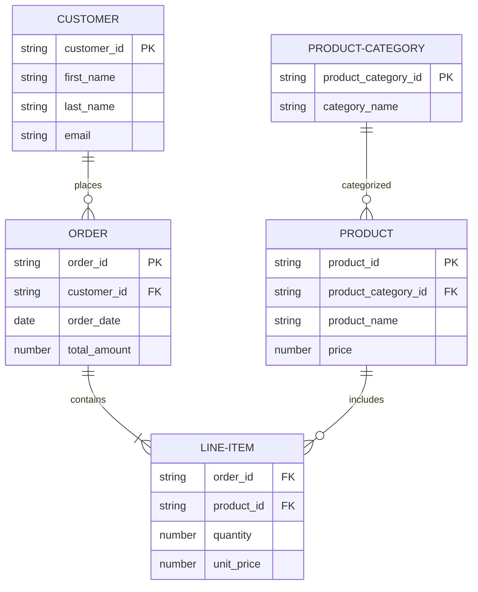

A snowflake schema is a type of data warehouse schema that is characterized by a more complex structure compared to a star schema. It is called a snowflake schema because its diagram resembles a snowflake shape when the entity-relationship model is laid out. The schema is made up of fact tables, dimension tables, and sub-dimension tables.

In a snowflake schema:

- **Fact tables** contain the core data typically related to business measurements, such as sales or transactions, and they are usually surrounded by dimension tables.
- **Dimension tables** store attributes or information about the dimensions of the fact table's data. For example, a dimension table might store information about customers, products, or time periods.
- **Sub-dimension tables**, also known as snowflaked dimensions, are related to dimension tables but contain more detailed attributes. These are normalized to remove redundancy, which means that the data is organized such that each piece of information is stored only once.

The structure can lead to more complex queries and require more joins, but it can also reduce data redundancy and improve data integrity.

Here's an example of a snowflake schema:

1. **CUSTOMER Table**:
This is a dimension table that holds data about customers.
Each customer has a unique `customer_id` (primary key), and additional attributes like `first_name`, `last_name`, and `email`.
In a real-world scenario, it could also include other relevant customer information such as address, phone number, or demographics.

2. **ORDER Table**:
This is a fact table that records the details of each order placed by customers.
It has its own `order_id` (primary key), a `customer_id` (foreign key that references the CUSTOMER table), `order_date`, and `total_amount`. 
his table captures the transactional data.

3. **LINE-ITEM Table**:
This is a sub-dimension table that details the individual items within an order.
It contains foreign keys referencing both the ORDER and PRODUCT tables (`order_id` and `product_id`), and records the `quantity` of each product ordered and the `unit_price` at which it was sold.

4. **PRODUCT Table**:
This is a dimension table that contains information about the products. Each product has a unique `product_id` (primary key), a `product_category_id` (foreign key that references the PRODUCT-CATEGORY table), `product_name`, and `price`.

5. **PRODUCT-CATEGORY Table**:
This is another dimension table that categorizes products.
It has a `product_category_id` (primary key) and a `category_name`.
It is related to the PRODUCT table, showing how products are grouped into categories.

In the snowflake schema, the relationships between the tables are as follows:

- The CUSTOMER table is related to the ORDER table by `customer_id`, indicating which customer placed which order.

- The ORDER table is related to the LINE-ITEM table by `order_id`, indicating which items are part of which order.

- The PRODUCT table is related to the LINE-ITEM table by `product_id`, showing which product corresponds to a specific line item in an order.

- The PRODUCT-CATEGORY table is related to the PRODUCT table by `product_category_id`, indicating the category to which each product belongs.

The snowflake schema example provided captures how a business might record and analyze its sales data. The schema is divided into logical parts that reflect the business operations: customers making orders, orders containing line items, and products being tied to specific categories. The normalization of this schema helps to ensure that updates to the data are easier to manage, but it can also lead to more complex queries due to the additional joins required.
