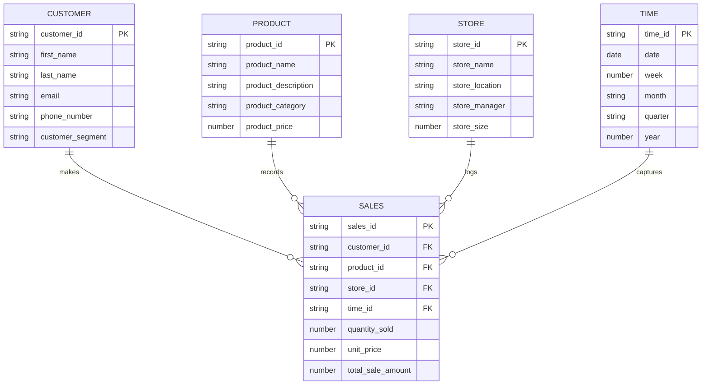

# Star Schema

A star schema is a type of database schema that is commonly used in data warehousing and business intelligence applications. It is called a star schema because its structure resembles a star, with a central fact table surrounded by dimension tables. The star schema is designed to optimize query performance by reducing the number of joins needed when querying data.

The star schema consists of two main components:

- **Fact Table**: This table is at the center of the star and contains quantitative data that one can aggregate for reporting and analysis. The fact table stores measurable, quantitative data, and typically includes foreign keys that link to the dimension tables.

- **Dimension Tables**: These tables surround the fact table and contain descriptive attributes (or dimensions) that are typically textual fields. They provide context for the facts, and each dimension table is linked to the fact table using a foreign key. Dimension tables are usually denormalized, which means that the data is organized to prioritize read performance, often at the expense of some data redundancy.

Now, let's consider an example of a star schema for a sales data warehouse:

1. **SALES Fact Table**:
This is the central table in the star schema. It records the sales transactions of the company.

2. **PRODUCT Dimension Table**:
This table stores information about the products that are being sold.

3. **CUSTOMER Dimension Table**:
This table contains details about the customers who are making purchases.

4. **STORE Dimension Table**: 
This table provides information about the locations or stores where the sales transactions take place.

5. **TIME Dimension Table**:
This table is a special dimension that records the time aspect of sales.

In a star schema, each dimension table is directly connected to the fact table.
This simplifies the data model and typically results in simpler, faster queries compared to a snowflake schema because there are fewer joins necessary to retrieve data.
The trade-off is that there can be redundancy in the dimension tables, and the denormalized structure can take up more space.

Here is a high-level explanation of how these tables interact in a star schema:

- The SALES fact table records each sale with quantitative data. If a customer buys a product, that transaction is recorded in the fact table, including the quantity of products sold and the total sale amount.
- The PRODUCT dimension table is referenced to understand what product was sold.
- The CUSTOMER dimension table is referenced to identify which customer made the purchase.
- The STORE dimension table provides context on where the sale took place.
- The TIME dimension table allows analysts to view the sale from a temporal perspective, such as analyzing sales by day, month, or year.

The star schema is particularly well-suited for business intelligence tools and reporting applications because it simplifies the database structure and reduces the complexity of SQL queries.
