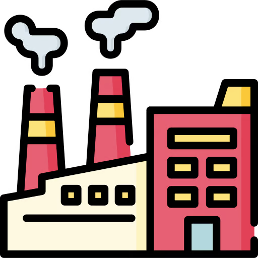

# Factory


The Factory Design Pattern is a creational pattern that provides a way to encapsulate the instantiation of a class within a separate component. 

This pattern is particularly useful when the creation process of an object is complex, or when the system should be independent of how its objects are created, composed, and represented. 

It's also beneficial when the system needs to be configured with one of multiple possible classes that share a common super class or interface.

In the Factory Pattern, instead of calling a constructor directly to create an object, you call a factory method that returns an instance of the appropriate subclass based on input parameters or the environment. 

This pattern allows for greater flexibility and decoupling because the code that utilizes the factory doesn't need to know the specific class that will be instantiated.

### Pros:
- Promoting the Open/Closed Principle:

    One of the core strengths of the Factory Method is its adherence to the open/closed principle.
    It allows our system to be open for extension but closed for modification .


- Decoupling and the Power of Abstraction:

    The Factory Method shines in promoting decoupling.
    A client side code interacts solely with the abstract class.
    This means we can provide different implementations of the abstract and the client code will not need to change.
    This is known as the dependency inversion principle.

### Cons:

- Increased Complexity: 

  Adding the factory method requires the creation of additional classes and interfaces, which increases overhead as well. 
  The code might become very complicated since we need to introduce a lot of new subclasses to implement the pattern.


- Might be hard to refactor:
  
  The factory pattern is deeply embedded into our system and it will require a lot of effort to replace it if in the future we decide to use some other implementation.

Here's a conceptual example of the Factory Pattern implemented in Python:
```python
from abc import ABC, abstractmethod

"""
1. Creator Interface or Abstract Class

This class/interface provides the declaration of the factory method. 
This method might be abstract or concrete, depending on the specific scenario.
If this method is declared as abstract, it just means that it is to be implemented by the concrete classes that extend it. 
This does not mean that the pattern becomes an abstract factory pattern.
Whether we choose to make use of an abstract class or an interface depends on the specific scenario. 
If there are shared behaviors or attributes among each concrete implementation of the Animal, an abstract class is a better choice.
However, if it is just the methods that need to be implemented, an interface would suffice.
The factory method might have default implementation in some cases. 
This factory method must return an instance of the Animal type - we shall see why.
"""
class Animal(ABC):
    @abstractmethod
    def speak(self):
        pass

"""
2. Concrete Creators

These are the subclasses that extend/implement the creator.
They will be overriding the factory method to produce concrete animals based on some input parameter.

Even though the factory method has a return type Animal, we can still return an instance of a concrete animal because it implements (or extends) the Animal interface/abstract class.
"""
class Dog(Animal):
    def speak(self):
        return "Woof!"

class Cat(Animal):
    def speak(self):
        return "Meow!"

class Cow(Animal):
    def speak(self):
        return "Moo!"

"""
3. Animal Interface or Abstract Class

This represents the contract for the types of animals the factory will produce.
"""
class AnimalFactory(ABC):
    @abstractmethod
    def create_animal(self):
        pass

"""
4. Concrete Products

These are concrete implementations of the animal interface or the abstract class. 
They define the specifics of each animal variant. 
Adding functionality each time is done through extension, rather than modification. 
This follows the Open/Closed principle closely.
"""
class DogFactory(AnimalFactory):
    def create_animal(self):
        return Dog()

class CatFactory(AnimalFactory):
    def create_animal(self):
        return Cat()

class CowFactory(AnimalFactory):
    def create_animal(self):
        return Cow()

# Client code
def get_animal_sound(animal_factory):
    animal = animal_factory.create_animal()
    return animal.speak()

# Create a dog using the DogFactory
dog_factory = DogFactory()
print(get_animal_sound(dog_factory))  # Output: Woof!

# Create a cat using the CatFactory
cat_factory = CatFactory()
print(get_animal_sound(cat_factory))  # Output: Meow!

# Create a cow using the CowFactory
cow_factory = CowFactory()
print(get_animal_sound(cow_factory))  # Output: Moo!

# If a new animal type is introduced, say Duck, we can add a new factory for it
class Duck(Animal):
    def speak(self):
        return "Quack!"

class DuckFactory(AnimalFactory):
    def create_animal(self):
        return Duck()

# Now we can use the new DuckFactory to create a Duck
duck_factory = DuckFactory()
print(get_animal_sound(duck_factory))  # Output: Quack!
```