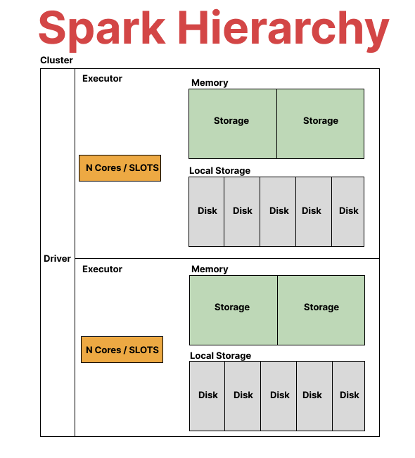

# What's the Spark Hierarchy?
Apache Spark's architecture is based on a master/worker hierarchy.

1. **Driver Program (Master Node):** 
    This is the program that declares the transformations and actions on data and submits such requests to the cluster.
    The driver program contains the main() function of the application.
    The driver program also creates a SparkContext which coordinates and monitors the execution of tasks.


2. **SparkContext:** 
    This is the heart of any spark functionality. 
    It establishes a connection to the Spark execution environment.
    It coordinates and monitors the execution of tasks.
    The SparkContext can be used to create resilient distributed datasets (RDDs), accumulators and broadcast variables on the cluster.


3. **Cluster Manager:** It can be a standalone manager (comes with Spark out of the box), or a Mesos or YARN manager.
    The role of the cluster manager is to negotiate resources between the driver program and the executor nodes.


4. **Executors:** 
    Executors are worker nodes' processes in charge of running individual tasks in a given Spark job.
    They run tasks that make up the application and return results to the driver node.
    They provide in-memory storage for RDDs that are cached by user programs through Block Manager.


5. **Tasks:** 
    Tasks are the smallest unit of work sent out to the executor.
    A task applies its dataset's transformations to a partition of the data, and it sends the results to the driver program or saves it to an external storage system.


6. **RDD (Resilient Distributed Dataset):** 
     This is a fundamental data structure of Spark.
     It is an immutable distributed collection of objects.
     Each dataset in RDD is divided into logical partitions, which may be computed on different nodes of the cluster.
     RDDs can contain any type of Python, Java, or Scala objects, including user-defined classes.


7. **DataFrame/Dataset:**
    These are distributed collections of data organized into named columns.
    They are designed to make large data sets processing even easier.
    The main difference between RDD and Datasets is that Datasets are organized into named columns with a known schema, enabling Spark to run certain optimizations on the finalized query.


8. **SparkSession:** 
   In Spark 2.0 and onwards, SparkSession provides a single point of entry to interact with underlying Spark functionality and allows programming Spark with DataFrame and Dataset APIs.
   A SparkSession can be used create DataFrame, register DataFrame as tables, execute SQL over tables, cache tables, and read parquet files.



# How do you optimize a spark job?

1. **Identify the problem first.**
    - Navigate to the Spark UI and examine the stages sorted by duration. Investigate the longest running stage.
    - Look out for any data spills to disk. Note that spills occur only during data shuffling such as during a join operation etc.
    - Review your physical query plan (the one executed by Spark). This can be done via `df.explain()`. Remember to read the plan from bottom to top.
  

2. **Examine a key aspect: data scanning using HIVE partitions.**
    - Check whether the table is partitioned efficiently. Ensure your query uses partitioned columns.
    - Optimizing data scanning is often a good starting point for performance improvement. If there's an issue here, fix it first.


3. **Analyze the query.**
    - Continue checking the query plan and the SQL tab on the WEB UI to identify potential bottlenecks.
    - In the SQL Tab, the term 'EXCHANGE' means shuffling!. Needs to be minimized!


4. **Consider using CACHE / PERSIST.**
    - If a data frame (df) is frequently used, consider using CACHE or PERSIST. But, make sure to use 'unpersist' when necessary.


5. **Examine tasks in the Spark UI.**
    - Look for any data skew in the problematic or long-running tasks. This can be measured by checking the disparity between the 75th percentile and maximum values. 
      If there is a big difference for data amount between 75th percentile and maximum, then you have data skew problem.


6. **Consider using a broadcast join, but cautiously.**
     - Use broadcast join if it is applicable. However, use this very carefully! Because in broadcasting, data is 
       moved to driver and not compressed anymore. So, 2GB of data might end up 100GB. (it is very good idea to verify
       the size of dataframe and check with the spark configuration for broadcast data amount. It has to be smaller than
       configured value. Otherwise, you have a problem)


7. **Limit the use of User-Defined Functions (UDFs).**
    - UDFs can slow down your job. If they're unavoidable, run performance tests to measure their impact.


8. **Avoid unnecessary actions.**
    - Reduce operations like count() where possible.


9. **Optimize distinct data operations.**
    - If you need distinct data, drop duplicates before joining. This reduces data shuffle during joins.


10. **Understand your hardware utilization.**
    - Use Ganglia to monitor CPU usage. Aim for high utilization (ideally to the point of saturation), 
      but for production workloads, aim for at least 70% utilization to accommodate data growth.

**Some concepts to keep in mind:**
- Reading data (table, etc.) is not an action until an action is called. However, Spark creates a small action to check metadata.
- The "ColumnarToRow" operation in the SQL Tab is for converting columnar data (orc, parquet) to rows for the application.
- Catalyst Optimizer finds the most efficient way to execute the query.
- There are two types of transformations in Spark:
  - **Narrow Transformations:** These do not involve SHUFFLING. Examples include adding a new column, filtering, altering a column, and selecting a column.
  - **Wide Transformations:** These involve SHUFFLING. Examples include repartition and coalesce operations, joins, and groupBy.

When writing data, if you don't actually want to write the data but want to execute it, use `df.write.format("noop")`. The "noop" command will not write the data, e.g., to S3.


### Q. Explain the key features of Spark and how PySpark leverages them.

-  Distributed Processing:
   Spark is designed to process data across a cluster of machines, allowing it to handle very large data sets. 
   It does this by breaking down the data (RDDs and DataFrames) into chunks, distributing the chunks across different nodes, and performing computations on them in parallel.


-  In-Memory Computation: 
   Spark stores data in RAM for faster access and processing. 
   This significantly increases the speed of iterative algorithms that need to pass over the data multiple times.


-  Fault Tolerance:
   Spark provides fault tolerance through the use of Resilient Distributed Datasets (RDDs). 
   This means that if a node fails, Spark can recover the lost data using the lineage information of the RDD and recompute it on a different node.


- Real-Time Processing: 
  Spark supports real-time processing, also known as stream processing, which is the processing of data in real-time as it comes in.


- Machine Learning Capabilities: 
  Spark provides a library called MLlib for machine learning. 
  It includes a variety of machine learning algorithms such as classification, regression, clustering, and collaborative filtering.


- Graph Processing Capabilities: 
  Spark has a library called GraphX for graph processing, which allows you to create, transform, and compute on graphs.


- Support for Various Languages: Spark supports multiple programming languages such as Scala, Java, Python, and R. 
  This means you can write Spark applications in the language you are most comfortable with.


### Q.  What is an RDD? What are transformations and actions in Spark?

An RDD, or Resilient Distributed Dataset, is the fundamental data structure of Apache Spark and PySpark. 
It is an immutable, distributed collection of objects that can be processed in parallel across a cluster. 
Each dataset in an RDD is divided into logical partitions, which may be computed on different nodes of the cluster. 
RDDs can contain any type of Python, Java, or Scala objects, including user-defined classes.

RDDs are fault-tolerant, meaning they automatically recover from failures. 
This is achieved by maintaining the lineage information (the series of transformations used to build the dataset), which allows Spark to recompute any lost data.

There are two types of operations in Spark that can be performed on RDDs:

- Transformations: 
  These are operations on RDDs that create a new RDD. 
  They are lazily evaluated, meaning the computation doesn't start until an action is called. 
  Examples of transformations include _map_, _filter_, _reduceByKey_, etc.


- Actions: 
  These are operations that return a value to the driver program or write data to an external storage system. 
  Actions trigger the execution using lineage graph to load the data into original RDD and carry out all intermediate transformations. 
  Examples of actions include _count_, _collect_, _first_, _take_, etc.

### Q. How does PySpark handle distributed data processing?

PySpark handles distributed data processing through the use of Resilient Distributed Datasets (RDDs) and DataFrames, which are two core data structures in Spark.

**Resilient Distributed Datasets (RDDs):** 
An RDD is a distributed collection of elements that can be processed in parallel. 
It is partitioned across the nodes in the cluster that can be operated on in parallel. 
RDDs are immutable, meaning that once you create an RDD, you cannot change it. 
However, you can transform it into a new RDD. 
Operations on RDDs are divided into two types: transformations and actions. 

**Transformations** are operations that produce a new RDD, and **actions** are operations that return a value to the driver program or write data to an external storage system. 
Transformations in Spark are lazily evaluated, which means computation doesn't start until an action is triggered.

DataFrames: A DataFrame in Spark is a distributed collection of data organized into named columns. 
It is conceptually equivalent to a table in a relational database or a data frame in Python/R, but with optimizations for speed and functionality. 
Just like RDDs, DataFrames can be transformed and actions can be performed on them. 
However, DataFrames also allow Spark to manage the schema, i.e., it knows what the data structure looks like. 
This allows Spark to optimize query plans through the Catalyst optimizer, making DataFrame operations faster than RDD operations.
Here is an example of how PySpark handles distributed data processing:
from pyspark.sql import SparkSession

```python
# Initialize a SparkSession
spark = SparkSession.builder \
    .appName('example') \
    .getOrCreate()

# Create a DataFrame
df = spark.read.json("example.json")

# Show the content of the DataFrame
df.show()
```
In this example, the spark.read.json call reads a JSON file and distributes it across the cluster as a DataFrame. 
The df.show() call is an action that triggers the computation, and Spark performs the computation in a distributed manner across the cluster.


### Q. What is the difference between persist() and cache() methods in PySpark?

In PySpark, both persist() and cache() methods are used to persist an RDD or DataFrame in memory for reuse in subsequent stages of computation, which can significantly improve the performance of your Spark application by avoiding the recomputation of intermediate results.

However, there is a difference between the two:

- cache(): 
  This method is a shorthand for using the persist() method with the StorageLevel.MEMORY_AND_DISK level. 
  When you call cache(), Spark will try to store as much of the RDD as possible in memory and will spill to disk only if necessary. 
  It does not allow you to specify a storage level.

```python
rdd = sc.parallelize(range(100))
rdd.cache()
```

- persist(): 
  This method allows you to specify a StorageLevel, giving you more control over how the RDD or DataFrame is stored. 
  You can choose to persist your data in serialized form and with varying levels of replication.

The different storage levels are:

- MEMORY_ONLY: Store RDD in memory only. 
- MEMORY_AND_DISK: Store RDD in memory and spill to disk when memory is full.
- MEMORY_ONLY_SER: Store RDD in serialized form in memory.
- MEMORY_AND_DISK_SER: Store RDD in serialized form in memory and spill to disk when memory is full.
- DISK_ONLY: Store RDD on disk only.

```python
from pyspark import StorageLevel
rdd = sc.parallelize(range(100))
rdd.persist(StorageLevel.DISK_ONLY)
```

In general, you would use cache() when you want to use the default storage level(MEMORY_AND_DISK), and persist(storageLevel) when you want to specify a particular storage level.


### Q. Explain the use of broadcast variables in PySpark.

In PySpark, broadcast variables are read-only variables that are cached on each node of the Spark cluster instead of sending a copy of the variable with tasks. 
They are used to give every node a copy of a large input dataset in an efficient manner.
Broadcast variables are useful when tasks across multiple stages need the same data or when caching the data in deserialized form is important.

Here's an example usage of a broadcast variable:
```python
# Creating a broadcast variable
broadcastVar = spark.sparkContext.broadcast([1, 2, 3, 4, 5])

# Accessing the value of the broadcast variable
broadcastVar.value
```

In this example, [1, 2, 3, 4, 5] is the data we're broadcasting. 
The broadcast() function sends the data to all nodes in the cluster. 
The value attribute is used to access the data.

Broadcast variables are typically used in two scenarios:

-  Joining a large and a small DataFrame: 
   If one DataFrame is small enough to fit in the memory of a single machine, we can broadcast the small DataFrame to all nodes and perform a map-side join instead of a reduce-side join. 
   This can significantly improve the performance of join operations.
```python
from pyspark.sql.functions import broadcast
# Assume df_large is a large DataFrame and df_small is a small DataFrame
df_result = df_large.join(broadcast(df_small), on="joinKey")
```

-  When we have a large static lookup table:
   If we have a large lookup table that's used across multiple stages and jobs, we can broadcast this lookup table so that it's available to all tasks.

Remember, changes to the broadcast variable value do not propagate to other nodes, they are read-only.
So, they are not suitable for counters or accumulators.

### Q. What are accumulators in PySpark and where are they typically used?

Accumulators in PySpark are special types of variables that are used for aggregating information across the executor nodes. 
They are write-only variables for tasks, which means tasks can only "add" to an accumulator, and cannot read its value. Only the driver program can read the value of an accumulator.
The primary purpose of accumulators is to aggregate results from worker nodes back to the driver node in an optimized and fault-tolerant way.

Accumulators are typically used in two scenarios:

- Counters: 
  If you want to count events that occur during job execution for debugging or logging purposes, you can use an accumulator. 
  For example, you might want to count the number of invalid records in an RDD.
```python

odd_counter = spark.sparkContext.accumulator(0)

def count_odds(x):
    global odd_counter
    if x % 2 != 0:
        odd_counter += 1
data = spark.sparkContext.parallelize(range(10))
data.foreach(count_odds)

print(odd_counter.value)  # Output: 5
```
- Sum:
  If you need to add up a large quantity of data, you can use an accumulator to add the elements of an RDD without having to bring all the data back to the driver node.
```python
accum = spark.sparkContext.accumulator(0)

def add_to_accum(x):
    global accum
    accum += x
data = spark.sparkContext.parallelize([1, 2, 3, 4, 5])
data.foreach(add_to_accum)

print(accum.value)  # Output: 15
```
Remember, accumulators have limitations. 
If a function with an accumulator is used in a transformation and the transformation is re-evaluated, the accumulator might end up being incremented twice. 
For this reason, it's recommended to use accumulators inside actions only.

### Q.  What are the performance considerations you keep in mind while working with PySpark?

Working with PySpark involves processing large datasets distributed across a cluster. 
Therefore, it's important to consider certain performance aspects to ensure your application runs efficiently and effectively. 
Here are some key performance considerations:

-  Minimize Data Shuffling:
   Data shuffling can be expensive in terms of both time and resources, as it involves redistributing data across partitions or even across nodes.
   Operations like groupByKey can cause data shuffling. Try to use operations that minimize shuffling, like reduceByKey or aggregateByKey.


-  Use Broadcast Variables:
   If you're working with a small DataFrame that's used across multiple stages, you should broadcast it.
   Broadcasting sends a read-only variable to all worker nodes once instead of multiple times, saving on network bandwidth and time.


-  Use Accumulators for Global Aggregations:
   If you need to perform a global sum or count, use accumulators.
   They provide a way to update a variable in parallel while executing tasks across multiple nodes.


-  Persist/Cache Intermediate Data:
   If an RDD or DataFrame is going to be reused multiple times, consider persisting or caching it.
   This stores the intermediate data in memory or disk so it doesn't need to be recomputed each time it's accessed.


-  Avoid Using Python UDFs:
   PySpark runs on the JVM and Python UDFs need to be executed through Py4J, which can be slow.
   If possible, use Spark's built-in functions or write your UDFs in Scala or Java.


-  Choose the Correct Data Structures:
   Use DataFrames or Datasets instead of RDDs where possible.
   The Catalyst Optimizer can optimize DataFrame and Dataset operations but not RDD operations.


-  Partitioning:
   Efficient partitioning can enhance the data locality of your Spark computations, and reduce the volume of data shuffled across the nodes.
   You can repartition your data based on the data skewness or based on the operations that you plan to perform.


-  Use the right file format:
   Different file formats and compression methods can have a great impact on performance.
   For instance, Parquet is a columnar storage file format and is optimized for use with Spark for its superior analytic performance.


-  Tune Spark Configuration:
   Depending on your workload, you may need to tune the configuration settings for Spark.
   This could involve optimizing the memory usage, garbage collection, serialization, and parallelism.
