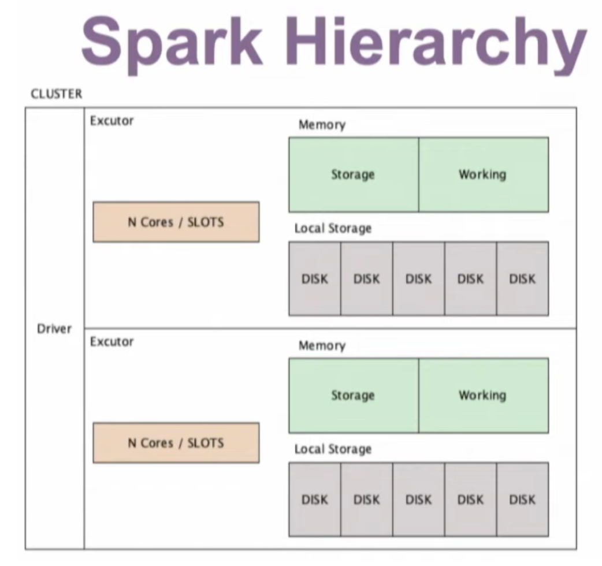

# How do you optimize a spark job?

1. FIRST, find the problem.
- Go to Spark UI -> check stages (sort by duration) and find the longest running stage to dive in.
- Also look for and any spills to disk (spilling to disk only happens when shuffling the data - join etc.)
- Check your physical query plan (this is the one executed by Spark). 
  - df.explain()
  - This must be read from bottom to top.
- One of the MOST important thing is to check, is it scanning the data using HIVE partitions (meaning is
table partitioned nicely / do you query the table using partitioned columns etc.). This data scan is very
important to start with when optimizing. If this is wrong, first fix this.
- Continue checking the query (physical plan / SQL tab on UI to identify what is the bottleneck)
  - In SQL Tab --> in the blocks/dags, EXCHANGE means shuffling!!! (needs to be minimum)
- Try to use CACHE / PERSIST (check whether unpersist is used), if the data (df) is used a lot.
- Check Tasks in Spark UI (for the long running / problematic one), Is there any data skew.
  - you can understand this while checking the quartiles. If there is a big difference for data amount between
  75th percentile and Max, then you have data skew problem.
- Use broadcast join if it is applicable. However, use this very carefully! Because in broadcasting, data is 
moved to driver and not compressed anymore. So, 2GB of data might end up 100GB. (it is very good idea to verify
the size of dataframe and check with the spark configuration for broadcast data amount. It has to be smaller than
configured value. Otherwise, you have a problem)
- Using UDFs are generally slows down the job. Make sure you avoid that, if not, do performance test.
- Avoid unnecessary actions such as count() etc.
- If you need distinct data, make sure you drop duplicates before JOIN (this will help to reduce the amount
of data for shuffling on joins.)
- Understand your hardware (Check Ganglia for CPU usage). Ideally, we want to melt down the servers (all red), 
but for production work loads, make sure that CPU is at least used around 70% (considering the data increase)

Some Concepts:
- Reading data (table etc.) is not an action (until an action is called), but sparks creates a small action for 
it to check metadata about it.
- ColumnarToRow (in SQL Tab) --> this is for converting columnar data (orc, parquet) to rows for the application
- Catalyst Optimizer finds the best way to execute the query
- There are 2 types of Transformations in Spark
  - Narrow Transformations: NO SUFFLE
    - adding new column, filter, alter column, select column
    - filter(), withColumn(), withColumnRenamed(), select()
  - Wide Transformations: There are shuffles
    - repartition
      - you have read your data and checked how many partitions (files in S3) you have, you can reorganize it.
      - try to avoid this, if you don't know what you are doing :)
      - this will merge partitions in the same executor.
    - coalesce
      - helps you to reduce the number of partitions. 
      - tries to avoid shuffling
    - joins
    - groupBy
- when you write data, if you don't actually want to write the data but want to execute that
  - df.write.format("noop").... --> noop will not write the data e.g. to s3!
